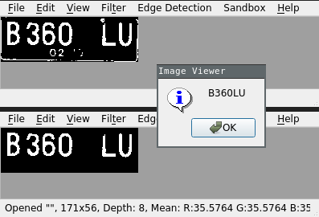
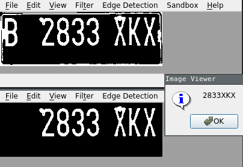
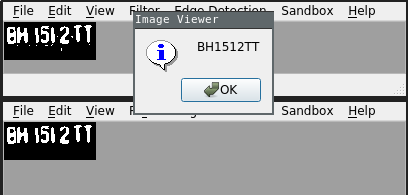

# Protoshop

A proto version of photoshop for if4073 processing and interpretation assignment.

## Setup

Requirement:

- qt5

How to run:

```bash
qmake
make
```

## Features

- Reading files PGM, PBM, BMP, raw format
- Support binary, grayscale, and colour image
- Adjustment:
  - Negative image
  - Brightening
  - Aritmethic operaon
  - Geometry transformation
  - Contrast stretching
  - Log and log inverse transformation
  - Exponential transformation
  - Gray level, bit plane slicing
  - Histogram equalization & specification
- Histogram and image statistic analysis
- Filtering:
  - Median, max, min filter
  - High pass filter
  - Unsharp masking
  - Highboost filter
- Fourier transform and inverse
- Edge detection:
  - Gradient
  - Second derivation
  - Laplace
  - LoG
  - Prewitt
  - Roberts
  - Canny
- Automatic Number Plate Recognition

## ANPR




